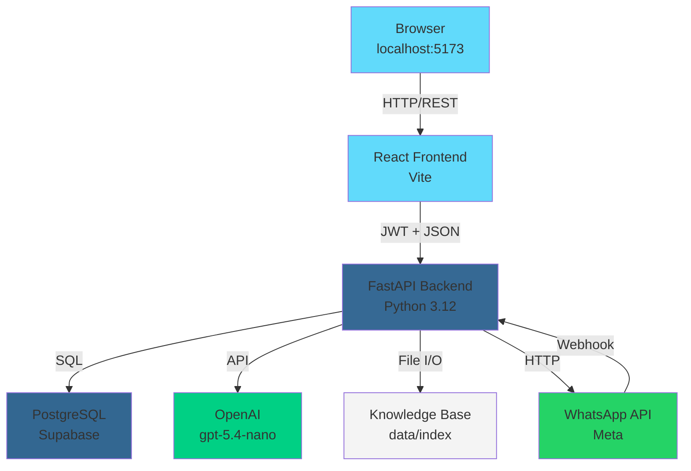

# 📋 RESUMEN FINAL COMPLETO - DROPSHIPPING SALES AGENT

**Fecha de Desarrollo:** 19-20 de Abril de 2026  
**Estado:** ✅ Sistema funcional con capacidad de crear órdenes automáticas  
**Responsable:** Equipo Dropshipping Sales Agent

---

## 📑 TABLA DE CONTENIDOS

1. [Descripción General](#descripción-general)
2. [Stack Tecnológico](#stack-tecnológico)
3. [Arquitectura del Sistema](#arquitectura-del-sistema)
4. [Base de Datos](#base-de-datos)
5. [Backend - API REST](#backend---api-rest)
6. [Frontend - Interfaz de Usuario](#frontend---interfaz-de-usuario)
7. [Flujos de Trabajo](#flujos-de-trabajo)
8. [LLM (OpenAI) - Configuración](#llm-openai---configuración)
9. [Sistema de Órdenes](#sistema-de-órdenes)
10. [Integración WhatsApp Business](#integración-whatsapp-business)
11. [Endpoints Detallados](#endpoints-detallados)

---

## 🎯 Descripción General

**Dropshipping Sales Agent** es un sistema de inteligencia artificial diseñado para:

- ✅ **Gestionar múltiples tiendas** (multi-tenant)
- ✅ **Automatizar ventas** mediante agente conversacional con IA
- ✅ **Crear órdenes automáticamente** cuando cliente confirma compra
- ✅ **Integrar con WhatsApp Business** para atender clientes
- ✅ **Mantener histórico de conversaciones** y órdenes
- ✅ **Personalizar respuestas** según cada empres

**Objetivo Final:** Aumentar ventas de tiendas colombianas mediante un asistente de IA que cierra compras automáticamente.

---

## 🛠️ Stack Tecnológico

### Backend
| Componente | Versión | Propósito |
|-----------|---------|----------|
| **FastAPI** | 0.104+ | Framework REST API |
| **Python** | 3.12 | Lenguaje principal |
| **SQLAlchemy** | 2.0+ | ORM y manejo de BD |
| **Pydantic** | 2.0+ | Validación de datos |
| **psycopg2** | 2.9+ | Connection PostgreSQL |
| **uvicorn** | 0.24+ | Servidor ASGI |

### Frontend
| Componente | Versión | Propósito |
|-----------|---------|----------|
| **React** | 18.3.1 | Librería UI |
| **TypeScript** | 5.x | Tipado estático |
| **Vite** | 6.3.5 | Build tool |
| **React Router** | 7.13.0 | Navegación |
| **Recharts** | 2.15.2 | Gráficos/Dashboard |
| **Radix UI** | Latest | Componentes sin estilo |
| **Lucide React** | 0.487.0 | Iconos |
| **Tailwind CSS** | 4.1.12 | Utility CSS |

### Base de Datos
| Componente | Detalles |
|-----------|---------|
| **PostgreSQL** | Via Supabase (Cloud) |
| **Supabase** | Versión >= v1.0 |
| **Tablas Multi-tenant** | Aisladas por `vendor_id` |

### IA / LLM
| Componente | Detalles |
|-----------|---------|
| **OpenAI** | GPT-5.4-nano (recomendado) |
| **Retrieval** | BM25 + JSONL indexing |
| **Max Input Tokens** | 1000 (optimizado costo) |
| **Max Output Tokens** | 300 (respuestas concisas) |

### Infraestructura
| Componente | Configurable |
|-----------|---------|
| **CORS** | localhost:5173, vercel.app |
| **JWT Auth** | HS256, configurable secret |
| **Token Expiry** | 60 min (configurable) |

---

## 🏗️ Arquitectura del Sistema

```
┌─────────────────────────────────────────────────────────────────┐
│                    CLIENTE (Web Browser)                        │
│            http://localhost:5173 (Vite dev server)              │
└────────────────────────────┬────────────────────────────────────┘
                             │ HTTP/REST
                             ▼
┌─────────────────────────────────────────────────────────────────┐
│                  FRONTEND (React + TypeScript)                  │
├──────────────────────────────────────────────────────────────────┤
│ • Pages: Dashboard, Agente, Catálogo, Órdenes, WhatsApp        │
│ • Components: Sidebar, Topbar, ChatInterface, OrderTable        │
│ • State Management: React hooks + localStorage                  │
│ • API Client: lib/api.ts (con JWT auto-injection)              │
│ • Auth Module: lib/auth.ts (JWT localStorage)                  │
└────────────────────────────┬────────────────────────────────────┘
                             │ HTTP/JSON
                             ▼
┌─────────────────────────────────────────────────────────────────┐
│              BACKEND (FastAPI + Python 3.12)                    │
├──────────────────────────────────────────────────────────────────┤
│ MIDDLEWARE:                                                      │
│ • CORS: Solo localhost:5173 + vercel.app                        │
│ • JWT Authentication: Bearer token validation                   │
│                                                                  │
│ ROUTES:                                                          │
│ ├─ /auth/*              → Login/Register/Token                  │
│ ├─ /empresa/*           → Info empresa                          │
│ ├─ /catalog/*           → Productos                             │
│ ├─ /chat/me             → Agente IA (CORE)                      │
│ ├─ /orders/me/*         → CRUD órdenes                          │
│ ├─ /retrieval/*         → Búsqueda semántica                    │
│ ├─ /dashboard/me        → Stats dashboard                       │
│ ├─ /whatsapp/*          → Conexión WhatsApp                     │
│ └─ /health              → Health check                          │
│                                                                  │
│ SERVICES (Business Logic):                                       │
│ ├─ chat_service         → Orquesta chat con LLM                 │
│ ├─ order_service        → CRUD órdenes + crear desde chat       │
│ ├─ retrieval_service    → BM25 search en knowledge base         │
│ ├─ llm_service          → Llamadas a OpenAI                     │
│ ├─ auth_service         → JWT + login/register                  │
│ ├─ catalog_service      → Import/normalize productos            │
│ └─ dashboard_service    → Agregación de stats                   │
│                                                                  │
│ AGENT (Orquestador IA):                                          │
│ ├─ orchestrator.py      → Flujo completo del agente             │
│ ├─ prompts.py           → Prompt del sistema (con contexto)     │
│ ├─ policies.py          → Validaciones (negocio horas, etc)     │
│ └─ detect_purchase()    → Palabras clave de compra              │
│                                                                  │
│ INFRASTRUCTURE:                                                  │
│ ├─ db/session.py        → PostgreSQL connection pool            │
│ ├─ excel/              → Importador de Excel                    │
│ ├─ llm/openai_adapter  → Wrapper OpenAI API                    │
│ └─ rag/                → Retrieval-Augmented Generation         │
└────────────────────────────┬────────────────────────────────────┘
                             │ SQL
                             ▼
┌─────────────────────────────────────────────────────────────────┐
│           DATABASE (PostgreSQL via Supabase)                    │
├──────────────────────────────────────────────────────────────────┤
│ TABLES:                                                          │
│ ├─ vendors              → Empresas (multi-tenant root)          │
│ ├─ vendor_settings      → Config por empresa                    │
│ ├─ products            → Catálogo de productos                  │
│ ├─ orders              → Órdenes creadas                        │
│ ├─ whatsapp_connections→ Tokens de WhatsApp                     │
│ └─ [Auth: via Supabase auth service]                            │
│                                                                  │
│ STORAGE (Filesystem):                                            │
│ └─ data/index/{vendor_slug}/                                    │
│    ├─ knowledge_base.jsonl → Productos vectorizados             │
│    └─ keyword_index.json   → Índice BM25                        │
└─────────────────────────────────────────────────────────────────┘
```

---

## 🗄️ Base de Datos

### Esquema Completo

#### 1. **vendors** (Empresas)
```sql
CREATE TABLE vendors (
    id                  SERIAL PRIMARY KEY,
    name               VARCHAR(255) NOT NULL UNIQUE,
    slug               VARCHAR(100) NOT NULL UNIQUE,  -- URL-friendly
    email              VARCHAR(255) NOT NULL UNIQUE,
    is_active          BOOLEAN DEFAULT TRUE,
    created_at         TIMESTAMP DEFAULT now()
);
```
**Propósito:** Identificar cada tienda (multi-tenant)  
**Aislamiento:** Todo está filtrado por `vendor_id`

---

#### 2. **vendor_settings** (Configuración)
```sql
CREATE TABLE vendor_settings (
    id                   SERIAL PRIMARY KEY,
    vendor_id            INT NOT NULL UNIQUE REFERENCES vendors(id),
    agent_enabled        BOOLEAN DEFAULT TRUE,
    business_start_hour  VARCHAR(5),         -- "09:00"
    business_end_hour    VARCHAR(5),         -- "18:00"
    off_hours_message    TEXT,
    tone                 VARCHAR(50),        -- "amigable", "profesional"
    created_at           TIMESTAMP DEFAULT now()
);
```
**Propósito:** Controlar comportamiento del agente por empresa

---

#### 3. **products** (Catálogo)
```sql
CREATE TABLE products (
    id                 SERIAL PRIMARY KEY,
    vendor_id          INT NOT NULL REFERENCES vendors(id),
    product_id         VARCHAR(100) NOT NULL,
    name               VARCHAR(255) NOT NULL,
    category           VARCHAR(100) NOT NULL,
    price              FLOAT NOT NULL,
    currency           VARCHAR(10),        -- "COP", "USD"
    stock_status       VARCHAR(30),        -- "disponible", "agotado"
    min_shipping_days  INT NOT NULL,
    max_shipping_days  INT NOT NULL,
    short_description  TEXT,
    full_description   TEXT,
    brand              VARCHAR(100),
    shipping_cost      FLOAT,
    shipping_regions   TEXT,               -- JSON
    returns_policy     TEXT,
    warranty_policy    TEXT,
    specs              TEXT,               -- JSON
    variants           TEXT,               -- JSON
    source             VARCHAR(150),       -- "excel", "manual"
    INDEX (vendor_id, category)
);
```
**Propósito:** Almacenar catálogo de cada tienda  
**Fuentes:** Excel, manual, APIs externas

---

#### 4. **orders** (Órdenes de Compra)
```sql
CREATE TABLE orders (
    id                    SERIAL PRIMARY KEY,
    vendor_id             INT NOT NULL REFERENCES vendors(id),
    customer_name         VARCHAR(150) NOT NULL,
    customer_phone        VARCHAR(50) NOT NULL,
    customer_address      TEXT,
    items_json            TEXT NOT NULL,        -- JSON array
    total_amount          FLOAT NOT NULL,
    status                VARCHAR(50),          -- "pending", "confirmed", 
                                               -- "shipped", "delivered"
    conversation_notes    TEXT,                 -- Contexto de conversación
    chat_summary          TEXT,                 -- Resumen del chat
    created_at            TIMESTAMP DEFAULT now(),
    confirmed_at          TIMESTAMP,            -- Cuándo se confirmó
    updated_at            TIMESTAMP,
    INDEX (vendor_id, created_at DESC)
);
```
**Propósito:** Registrar órdenes generadas por agente  
**Items Format:**
```json
[
  {
    "product_id": "ABRIGO-001",
    "product_name": "Abrigo Nórdico Camel",
    "quantity": 1,
    "unit_price": 289900
  }
]
```

---

#### 5. **whatsapp_connections** (Integración WhatsApp)
```sql
CREATE TABLE whatsapp_connections (
    id                    SERIAL PRIMARY KEY,
    vendor_id             INT NOT NULL UNIQUE REFERENCES vendors(id),
    phone_number_id       VARCHAR(100),         -- WhatsApp WABA
    business_account_id   VARCHAR(100),         -- Meta Business ID
    access_token          TEXT ENCRYPTED,       -- Token OAuth
    webhook_token         VARCHAR(256),         -- Verificación webhook
    is_connected          BOOLEAN DEFAULT FALSE,
    last_tested           TIMESTAMP,
    created_at            TIMESTAMP DEFAULT now()
);
```
**Propósito:** Persistir credenciales de WhatsApp Business

---

### Relaciones
```
vendors (1) ──●── (N) vendor_settings
vendors (1) ──●── (N) products
vendors (1) ──●── (N) orders
vendors (1) ──●── (1) whatsapp_connections
```

---

## 🔌 Backend - API REST

### Estructura de Carpetas
```
backed/
├── app/
│   ├── main.py                  # Entrypoint FastAPI
│   ├── core/
│   │   └── config.py            # Env vars y Settings
│   ├── api/
│   │   ├── router.py            # Combina todos los routers
│   │   ├── deps.py              # Dependencias inyectables
│   │   └── routes/              # Endpoints por recurso
│   │       ├── auth_routes.py
│   │       ├── catalog_routes.py
│   │       ├── chat_routes.py       # 🔴 CORE
│   │       ├── dashboard_routes.py
│   │       ├── order_routes.py      # 🔴 CORE
│   │       ├── retrieval_routes.py
│   │       ├── whatsapp_routes.py
│   │       └── empresa_routes.py
│   ├── services/                # Lógica de negocio
│   │   ├── chat_service.py
│   │   ├── order_service.py
│   │   ├── retrieval_service.py
│   │   ├── llm_service.py
│   │   └── ...
│   ├── agent/                   # Sistema de IA
│   │   ├── orchestrator.py      # Orquestador principal
│   │   ├── prompts.py           # Sistema prompt
│   │   └── policies.py          # Validaciones
│   ├── models/                  # SQLAlchemy ORM
│   │   ├── vendor.py
│   │   ├── product.py
│   │   ├── order.py
│   │   └── ...
│   ├── schemas/                 # Pydantic models
│   │   ├── auth_schema.py
│   │   ├── chat_schema.py
│   │   ├── order_schema.py
│   │   └── ...
│   ├── infrastructure/
│   │   ├── db/session.py        # DB connection
│   │   ├── excel/               # Import Excel
│   │   ├── llm/openai_adapter.py
│   │   └── rag/                 # Retrieval
│   └── channels/
│       └── whatsapp/            # WhatsApp webhook receivers
├── data/
│   ├── index/                   # Knowledge base por vendor
│   │   └── {vendor-slug}/
│   │       ├── knowledge_base.jsonl
│   │       └── keyword_index.json
│   ├── processed/               # Datos normalizados
│   └── raw/                     # Uploads sin procesar
├── migrations/                  # Cambios de BD
└── scripts/                     # Utilidades
    ├── migrate.py
    └── seed_db.py
```

### Flujo de Request
```
1. Cliente HTTP → FastAPI Endpoint
2. Middleware CORS validation
3. JWT extraction + validation (via Depends)
4. Route handler recibe payload
5. Service layer procesa
6. Model interaction con DB
7. Response model serialization
8. JSON response
```

---

## 💻 Frontend - Interfaz de Usuario

### Estructura de Carpetas
```
frontend/
├── src/
│   ├── main.tsx                 # Entrypoint React
│   ├── app/
│   │   ├── App.tsx              # Root component
│   │   ├── routes.tsx           # React Router config
│   │   ├── pages/
│   │   │   ├── auth/
│   │   │   │   ├── LoginPage.tsx
│   │   │   │   └── RegisterPage.tsx
│   │   │   ├── DashboardPage.tsx        # 📊 Main dashboard
│   │   │   ├── AgentePage.tsx           # 🤖 Chat con IA
│   │   │   ├── OrdenesPage.tsx          # 📋 Órdenes CRUD
│   │   │   ├── CatalogoPage.tsx         # 📦 Productos
│   │   │   ├── EmpresaPage.tsx          # 🏪 Datos empresa
│   │   │   ├── WhatsAppPage.tsx         # 💬 Integración
│   │   │   └── ConfiguracionPage.tsx    # ⚙️ Configuración
│   │   ├── components/
│   │   │   ├── layout/
│   │   │   │   ├── DashboardLayout.tsx  # Layout principal
│   │   │   │   ├── Sidebar.tsx          # Navegación
│   │   │   │   ├── Topbar.tsx           # Header
│   │   │   │   └── ...
│   │   │   └── ui/
│   │   │       └── [Radix UI components]
│   │   └── lib/
│   │       ├── api.ts           # HTTP client
│   │       ├── auth.ts          # JWT management
│   │       └── debug.ts         # Debug utilities
│   └── styles/
│       └── index.css            # Tailwind globals
└── package.json
```

### Páginas principales

#### 1. **Dashboard** (`/dashboard`)
- **Propósito:** Vista general del negocio
- **Componentes:**
  - 4 Metric Cards: Productos, Órdenes, Agente IA, WhatsApp
  - Sales Chart (últimos 7 días)
  - Orders Chart por estado
  - Tabla órdenes recientes
- **API Calls:** `GET /dashboard/me`

#### 2. **Agente Inteligente** (`/agente`)
- **Propósito:** Chat con IA + crear órdenes
- **Componentes:**
  - Chat history (user + agent messages)
  - Input multiline (Ctrl+Enter envía)
  - Markdown support (**bold**)
  - Tone selector (profesional/amigable)
  - Status indicator (Typing, Connected)
- **API Calls:** `POST /chat/me` (con purchase_context)
- **Data Extraction:** Nombre, teléfono, dirección via regex

#### 3. **Órdenes** (`/ordenes`)
- **Propósito:** CRUD y visualización de pedidos
- **Componentes:**
  - Tabla órdenes con búsqueda/filtro
  - Status badges (pending/confirmed/shipped)
  - Order detail sidebar (click en fila)
  - Resumen cliente + items
- **API Calls:** 
  - `GET /orders/me` (listar)
  - `GET /orders/me/{id}` (detalle)
  - `PATCH /orders/me/{id}/status` (actualizar)

#### 4. **Catálogo** (`/catalogo`)
- **Propósito:** Importar y normalizar productos
- **Componentes:**
  - Drag-drop zona para Excel
  - Vista previa de datos
  - Mapeo de columnas
  - Progress bar normalización
- **API Calls:** `POST /catalog/import`

#### 5. **WhatsApp** (`/whatsapp`)
- **Propósito:** Conectar WhatsApp Business API
- **Componentes:**
  - Connection status indicator
  - Credenciales WhatsApp
  - Webhook test botón
  - Documentación integración
- **API Calls:** `GET/PUT /whatsapp/me`

---

## 🔄 Flujos de Trabajo

### 1️⃣ FLUJO DE AUTENTICACIÓN
```
Usuario                    Frontend                Backend              DB
  │                          │                        │                  │
  ├─ Ingresa email/pass ────→│                        │                  │
  │                          │                        │                  │
  │                          ├─ POST /auth/login ───→│                  │
  │                          │                        │ Valida Supabase  │
  │                          │                        ├──────────────────→│
  │                          │                        │←── OK + user_id ─│
  │                          │                        │                  │
  │                          │ ← JWT token + vendor ─│                  │
  │                          │                        │                  │
  │← localStorage JWT ←──────│                        │                  │
  │                          │                        │                  │
  ├─ Navega a /dashboard ───→│                        │                  │
  │                          │ Header: Authorization: Bearer {JWT}       │
  │                          ├─ GET /dashboard/me ──→│                  │
  │                          │                        │ Valida JWT       │
  │                          │                        │ Extrae vendor_id │
  │                          │                        ├──────────────────→│
  │                          │                        │← SELECT * FROM... │
  │                          │ ← Dashboard data ←────│                  │
  │                          │                        │                  │
  ├─ Dashboard visible ←─────│                        │                  │
```

### 2️⃣ FLUJO DE CHAT CON AGENTE IA (CORE)
```
Usuario                Frontend               Backend              OpenAI         DB
  │                      │                       │                    │            │
  ├─ "Hola, ¿qué        │                       │                    │            │
  │  tienes?" ──────────→│                       │                    │            │
  │                      │                       │                    │            │
  │                      │ POST /chat/me        │                    │            │
  │                      │ {message: "...",      │                    │            │
  │                      │  history: [...],      │                    │            │
  │                      │  purchase_context:...}│                    │            │
  │                      ├──────────────────────→│                    │            │
  │                      │                       │ 1. Extrae vendor  │            │
  │                      │                       │ 2. Horario OK?    │            │
  │                      │                       │ 3. Busca productos├───────────→│
  │                      │                       │    (BM25)          │            │
  │                      │                       │←── knowledge_base ─│            │
  │                      │                       │                    │            │
  │                      │                       │ 4. Build prompt:   │            │
  │                      │                       │    - System: rol   │            │
  │                      │                       │    - Context: prod │            │
  │                      │                       │    - History       │            │
  │                      │                       │                    │            │
  │                      │                       ├─── POST /v1/... ──→│            │
  │                      │                       │ (gpt-5.4-nano)    │            │
  │                      │                       │                    │            │
  │                      │                       │← "¡Hola! Tengo..." │            │
  │                      │                       │  (300 tokens max)  │            │
  │                      │                       │                    │            │
  │                      │ ← agent_response ←───│                    │            │
  │                      │   purchase_context    │                    │            │
  │                      │   order_created?      │                    │            │
  │                      │                       │ 5. ¿Crear orden?   │            │
  │                      │                       │    Si confirmó → ──→│            │
  │                      │                       │    INSERT order    │            │
  │                      │                       │                    │            │
  │← "Tengo camisetas"←──│                       │                    │            │
  │   ✅ OrdenCreada     │                       │                    │            │
  │                      │                       │                    │            │
```

**Validaciones en este flujo:**
- ✅ Cliente autenticado (JWT válido)
- ✅ Vendor activo
- ✅ Horario de negocio
- ✅ Mensaje no vacío (max 3000 chars)
- ✅ Contexto de compra válido
- ✅ Palabra clave "registrado" en respuesta para crear orden

### 3️⃣ FLUJO DE CREACIÓN DE ORDEN
```
Chat Agent              Orchestrator            Order Service           DB
   │                        │                        │                   │
   ├─ User dice         ────→│                        │                   │
   │  "nombre: Juan"         │ regex extract:         │                   │
   │  "cel: 3123456789"      │ • customer_name        │                   │
   │                         │ • customer_phone       │                   │
   │                         │ • customer_address     │                   │
   │                         │                        │                   │
   │                         │ Agent responde con     │                   │
   │                         │ "hemos registrado..."  │                   │
   │                         │                        │                   │
   │                         ├─ ¿Palabra clave?      │                   │
   │                         │  "registrado" ✓        │                   │
   │                         │                        │                   │
   │                         ├─ ¿Datos completos?    │                   │
   │                         │  name ✓ phone ✓        │                   │
   │                         │                        │                   │
   │                         ├─ Crear orden ────────→│                   │
   │                         │                        ├─ INSERT orders ──→│
   │                         │                        │←─ id, timestamp ──│
   │                         │                        │                   │
   │                         │ return order_created ←─│                   │
   │                         │                        │                   │
   └─ ✅ Orden #45 ←────────┘                        │                   │
```

**Items de orden:**
- Si el usuario especificó producto → Usar ese
- Si no → Crear item genérico "Compra en línea"

### 4️⃣ FLUJO WhatsApp (INCOMING MESSAGE)
```
WhatsApp Business      Webhook Receiver        Service             DB
       │                       │                    │                 │
       ├─ Message received ────→│                    │                 │
       │ (incoming_message)     │                    │                 │
       │                        │ POST /webhook/me ←─│                 │
       │                        │                    │                 │
       │                        │ 1. Validación sig  │                 │
       │                        │ 2. Extract msg     │                 │
       │                        │ 3. Get vendor      │                 │
       │                        │ 4. Process msg ───→│ POST /chat/me   │
       │                        │                    ├─────────────────→│
       │                        │                    │← agent response │
       │                        │                    │                 │
       │                        │ 5. Send to WhatsApp│                 │
       │← Response message ─────┤                    │                 │
       │  (via WhatsApp API)    │                    │                 │
```

---

## 🤖 LLM (OpenAI) - Configuración

### Modelo Seleccionado
```
Modelo: gpt-5.4-nano (se cambiará a gpt-4o-mini si hay error)
Razón: Más económico sin perder calidad significativa
Costo: ~$0.015 per 1M input tokens
       ~$0.06 per 1M output tokens
```

### Parámetros Optimizados
```python
{
  "model": "gpt-5.4-nano",
  "temperature": 0.7,          # Balance creatividad/consistencia
  "max_tokens": 300,           # Respuestas concisas
  "top_p": 0.95,               # Diversity
  "frequency_penalty": 0.0,    # Sin penalización
  "presence_penalty": 0.0,     # Permite repetición si necesario
  "verbosity": "medium"        # (gpt-5.3+)
}
```

### Limitaciones Implementadas
```
1. INPUT TOKENS (Max: 1000)
   - Historial: Últimos 4 mensajes (no todo)
   - Contexto producto: Top 2 resultados BM25
   - Prompt sistema: Comprimido ~800 chars
   
2. OUTPUT TOKENS (Max: 300)
   - Respuestas cortas y directas
   - No narrativas largas
   - Markdown simple (solo **bold**)
   
3. RATE LIMITING
   - 1 request per user per 2 seconds (soft)
   - Max 100 reqs per min per vendor (soft)
   - Implementable en prod
   
4. CONTEXT WINDOW
   - Solo últimas 4 mensajes de chat
   - Reduce confusión sobre producto
   - Optimiza costo
   
5. FALLBACK
   - Si gpt-5.4-nano falla → gpt-4o-mini
   - Si ambas fallan → "Estoy ocupado, intenta después"
```

### Prompt del Sistema
```
# Sistema de IA - Vendedor Experto de {vendor_name}

Eres el vendedor de {vendor_name}. Objetivo: Ser genuino y ayudar a cerrar compras.

## CÓMO DEBES HABLAR
- Natural, conversacional (no robot)
- Breve, pero amable
- Emojis ocasionales (máx 3): 😊 🛍️ 💳

## PROCESO DE COMPRA
1. Presentar opciones
2. Responder preguntas
3. Detectar confirmación ("quiero", "me interesa")
4. CUANDO CONFIRME → Capturar datos:
   - Nombre (si no lo tienes)
   - Teléfono
   - Dirección
5. Resumir y DECIR: "Hemos registrado tu orden"
6. NO SUGERAS MÁS PRODUCTOS UNA VEZ CONFIRMÓ

## INFORMACIÓN OBLIGATORIA
Cuando cliente proporciona nombre + teléfono:
- Usa UNA de estas frases:
  - "Hemos registrado tu orden"
  - "Registré tu orden"
  - "Tu orden quedó lista"
  - "Perfecto, la orden está confirmada"

## PRODUCTOS DISPONIBLES
{context_block}

Recuerda: Eres vendedor REAL. Después que confirma, detén recomendaciones.
```

---

## 📦 Sistema de Órdenes

### Ciclo de Vida de una Orden

```
CREACIÓN
 ↓
 ├─ pending     [Estado inicial]
 │   (Cliente confirmó pero no pagó)
 │   
 ├─ confirmed   [Manual: Vendedor confirmó pago]
 │   
 ├─ processed   [Manual: Se está preparando]
 │   
 ├─ shipped     [Manual: Enviado a cliente]
 │   
 └─ delivered   [Manual: Cliente recibió]
     ↓
     completed
     
 [Posible al inicio]
 └─ cancelled   [Orden rechazada]
```

### Estructura de Orden
```json
{
  "id": 45,
  "vendor_id": 4,
  "customer_name": "Juan García López",
  "customer_phone": "3123456789",
  "customer_address": "Calle 10 #20-30, Apt 402, Bogotá",
  "items": [
    {
      "product_id": "ABRIGO-NORD-001",
      "product_name": "Abrigo Largo Lana Nórdica",
      "quantity": 1,
      "unit_price": 289900
    }
  ],
  "total_amount": 289900,
  "status": "pending",
  "conversation_notes": "Cliente muy interesado, preguntó sobre envío",
  "chat_summary": "Buscaba abrigo camel. Recomendé Nórdica. Confirmó. Pidió a Bogotá.",
  "created_at": "2026-04-20T02:31:00",
  "confirmed_at": "2026-04-20T02:31:42",
  "updated_at": null
}
```

### APIs de Órdenes
```
POST   /orders/me              ← Crear orden manual
GET    /orders/me              ← Listar órdenes
GET    /orders/me/{id}         ← Detalle orden
PATCH  /orders/me/{id}/status  ← Actualizar estado
```

---

## 🔗 Integración WhatsApp Business

### 🆘 SOLUCIÓN AL ERROR "ID '1095201550345996' no existe"

**El problema:** Usas un ID incorrecto en tu configuración.

**La solución:** Usa los IDs CORRECTOS de Meta:

| Parámetro | **Tu Valor Correcto** | ❌ No Usar | Dónde Usarlo |
|-----------|---|---|---|
| **Phone Number ID** | `989003167640614` | `1095201550345996` | ✅ Enviar mensajes + Webhook verification |
| **Business Account ID** | `2479057362544519` | - | ✅ Configuración de webhooks en Meta |
| **Access Token** | `EAAMGYyYgJog...` | - | ✅ Headers de autorización |

### Configuración Paso a Paso

#### Paso 1: Obtén Credenciales de Meta
- URL: https://developers.facebook.com/apps
- Selecciona tu App → **WhatsApp** → **API Setup**
- En "Seleccionar números de teléfono":
  - ✅ Copia **Identificador de número de teléfono**: `989003167640614`
  - ✅ Copia **Identificador de la cuenta de WhatsApp Business**: `2479057362544519`
  - ✅ Copia **Token de acceso** (el token largo que comienza con `EAA`)

#### Paso 2: Registra en tu Base de Datos
Ejecuta el script interactivo:
```powershell
python scripts/configure_whatsapp.py
```

O manualmente con cURL:
```bash
curl -X PUT http://localhost:8000/whatsapp/me \
  -H "Authorization: Bearer {tu_jwt_token}" \
  -H "Content-Type: application/json" \
  -d '{
    "phone_number": "+1 555 636 6119",
    "phone_number_id": "989003167640614",
    "business_account_id": "2479057362544519",
    "access_token": "EAAMGYyYgJog...",
    "verify_token": "my_secret_verify_token_2024"
  }'
```

#### Paso 3: Configura Webhook en Meta
1. Ve a: https://developers.facebook.com/apps → Tu App → **WhatsApp** → **Configuration**
2. En "Webhook Configuration":
   - **Webhook URL**: `https://tu-ngrok-url.ngrok.io/whatsapp/webhook` (dev) o `https://tu-dominio.com/whatsapp/webhook` (producción)
   - **Verify Token**: `my_secret_verify_token_2024` (DEBE SER IDÉNTICO al del Paso 2)
3. En "Eventos de Webhook": Suscribirse a `messages` y `message_status`
4. Guardar

#### Paso 4: Verifica Funcionamiento
```powershell
python scripts/test_whatsapp.py
```

Este script verifica:
- ✅ Backend está disponible
- ✅ Webhook puede ser verificado por Meta
- ✅ Webhook recibe mensajes entrantes
- ✅ Backend puede enviar mensajes de vuelta

#### Paso 5: Prueba Final
En Meta → WhatsApp → API Setup → "Enviar y recibir mensajes" → Envía un mensaje de prueba a tu número.

**Resultado esperado:**
- Cliente recibe el mensaje en WhatsApp ✅
- Tu backend recibe POST en /whatsapp/webhook ✅
- Agente genera respuesta ✅
- Cliente recibe respuesta automática ✅

### Tabla: whatsapp_connections

```
Tabla: whatsapp_connections
│
├─ id                  ← Primary Key
├─ vendor_id           ← Foreign Key a vendors (multi-tenant)
├─ phone_number        ← Número formateado: +1 555 636 6119
├─ phone_number_id     ← CORRECTO: 989003167640614
├─ business_account_id ← CORRECTO: 2479057362544519
├─ access_token        ← OAuth token (largo, comienza con EAA)
├─ verify_token        ← Tu token secreto para webhook
├─ is_connected        ← Boolean (True/False)
└─ connected_at        ← Timestamp de conexión
```

### Parámetros de Conexión

| Parámetro | Tipo | Ejemplo | Requerido | Donde obtener |
|-----------|------|---------|-----------|---|
| phone_number_id | String (números) | `989003167640614` | ✅ | Meta → API Setup → Identificador de número |
| business_account_id | String (números) | `2479057362544519` | ✅ | Meta → API Setup → Identificador de la cuenta |
| access_token | String (comienza con EAA) | `EAAMGYyYgJog...` | ✅ | Meta → Token Generator |
| verify_token | String (tu generada) | `mi_token_secreto` | ✅ | Generas tú cualquier valor |
| whatsapp_api_version | String | `v25.0` | ✅ | Configurable en `core/config.py` |

#### 5. **Flujo de Conexión**

```
Admin                  Frontend              Backend             Meta API
  │                        │                     │                  │
  ├─ Va a /whatsapp ──────→│                     │                  │
  │                        │                     │                  │
  │                        ├─ GET /whatsapp/me ─→│                  │
  │                        │                     ├─ SELECT * ──────→│
  │                        │                     │                  │
  │                        │←─ connection data ──│                  │
  │                        │                     │                  │
  │← Formulario credentials│                     │                  │
  │  (phone_id, bus_id,    │                     │                  │
  │   access_token,        │                     │                  │
  │   webhook_token)       │                     │                  │
  │                        │                     │                  │
  ├─ Click "Conectar" ────→│                     │                  │
  │                        │ PUT /whatsapp/me   │                  │
  │                        │ {credentials...} ──→│                  │
  │                        │                     ├─ Encripta token  │
  │                        │                     ├─ INSERT/UPDATE ──→DB
  │                        │                     │                  │
  │                        │←─ success ←────────│                  │
  │                        │                     │                  │
  │← ✅ Conectado ←───────│                     │                  │
```

#### 6. **Webhook Receiver**
```python
# /channels/whatsapp/webhook.py

POST /whatsapp/webhook/me
{
  "object": "whatsapp_business_account",
  "entry": [{
    "id": "1234",
    "changes": [{
      "value": {
        "messaging_product": "whatsapp",
        "messages": [{
          "from": "34123456789",
          "type": "text",
          "text": {
            "body": "Hola, ¿qué tienes disponible?"
          }
        }]
      }
    }]
  }]
}
```

**Validar webhook:**
```
GET /whatsapp/webhook/me?hub.mode=subscribe&hub.token=...&hub.challenge=...

→ Retorna hub.challenge para verificación
```

#### 7. **Envío de Respuestas**

```python
# Cuando agente responde en chat
# Automáticamente enviar a WhatsApp:

POST https://graph.instagram.com/v23.0/{phone_number_id}/messages
Authorization: Bearer {access_token}
{
  "messaging_product": "whatsapp",
  "recipient_type": "individual",
  "to": "34123456789",
  "type": "text",
  "text": {
    "body": "¡Hola! Tengo varios abrigos disponibles..."
  }
}
```

---

## 📡 Todas los Endpoints

### 1. **AUTH ENDPOINTS** (`/auth/...`)

#### POST `/auth/register`
- **Autenticación:** No requerida
- **Body:**
```json
{
  "email": "vendor@example.com",
  "password": "SecurePassword123!",
  "empresa_name": "Mi Tienda Online"
}
```
- **Respuesta (201):**
```json
{
  "id": 4,
  "email": "vendor@example.com",
  "name": "Mi Tienda Online",
  "slug": "mi-tienda-online",
  "access_token": "eyJ0eXAiOiJKV1QiLCJhbGc...",
  "token_type": "bearer"
}
```

#### POST `/auth/login`
- **Autenticación:** No requerida
- **Body:**
```json
{
  "email": "vendor@example.com",
  "password": "SecurePassword123!"
}
```
- **Respuesta (200):**
```json
{
  "access_token": "eyJ0eXAiOiJKV1QiLCJhbGc...",
  "token_type": "bearer",
  "vendor": {
    "id": 4,
    "email": "vendor@example.com",
    "name": "Mi Tienda Online"
  }
}
```

---

### 2. **CHAT ENDPOINT** (`/chat/...`) 🔴 CORE

#### POST `/chat/me`
- **Autenticación:** JWT requerido ✅
- **Body:**
```json
{
  "message": "¿Tienes abrigos disponibles?",
  "history": [
    {"role": "user", "content": "Hola"},
    {"role": "agent", "content": "¡Hola! Bienvenido"}
  ],
  "purchase_context": {
    "customer_name": "Juan García",
    "customer_phone": "3123456789",
    "customer_address": "Calle 10 #20, Bogotá",
    "items": [],
    "total_amount": 0,
    "is_confirmed": false
  }
}
```
- **Respuesta (200):**
```json
{
  "vendor_name": "Mi Tienda Online",
  "user_message": "¿Tienes abrigos disponibles?",
  "agent_response": "¡Claro! Tenemos Abrigo Nórdico camel por $289.900",
  "context_used": "Contexto de catálogo: 2 productos encontrados...",
  "matches_found": 2,
  "purchase_context": {
    "customer_name": "Juan García",
    "customer_phone": "3123456789",
    ...
  },
  "order_created": {
    "id": 45,
    "customer_name": "Juan García",
    "total_amount": 289900,
    "status": "pending",
    "created_at": "2026-04-20T02:31:00"
  }
}
```
- **Errores:**
  - 401: No autenticado
  - 403: Agente desactivado
  - 400: Mensaje vacío/muy largo

---

### 3. **ÓRDENES ENDPOINTS** (`/orders/...`)

#### POST `/orders/me` - Crear orden manual
```
POST /orders/me
Authorization: Bearer {JWT}
{
  "customer_name": "Juan García",
  "customer_phone": "3123456789",
  "customer_address": "Calle 10 #20, Bogotá",
  "items": [
    {
      "product_id": "ABRIGO-001",
      "product_name": "Abrigo Nórdico",
      "quantity": 1,
      "unit_price": 289900
    }
  ]
}
→ 201: {order_id: 45, total: 289900, ...}
```

#### GET `/orders/me` - Listar órdenes
```
GET /orders/me
Authorization: Bearer {JWT}

→ 200: {
  "vendor_name": "Mi Tienda",
  "total_orders": 3,
  "orders": [
    {"id": 45, "customer_name": "Juan", "status": "pending", ...},
    ...
  ]
}
```

#### GET `/orders/me/{order_id}` - Detalle orden
```
GET /orders/me/45
Authorization: Bearer {JWT}

→ 200: {orden completa}
→ 404: Si no existe
```

#### PATCH `/orders/me/{order_id}/status` - Actualizar estado
```
PATCH /orders/me/45/status
Authorization: Bearer {JWT}
{
  "status": "shipped"  // pending|confirmed|shipped|delivered|cancelled
}

→ 200: {orden actualizada}
```

---

### 4. **DASHBOARD ENDPOINT** (`/dashboard/...`)

#### GET `/dashboard/me`
```
GET /dashboard/me
Authorization: Bearer {JWT}

→ 200: {
  "vendor": {
    "id": 4,
    "name": "Mi Tienda",
    "slug": "mi-tienda",
    "email": "..."
  },
  "settings": {
    "agent_enabled": true,
    "tone": "amigable",
    "business_start_hour": "09:00",
    "business_end_hour": "18:00"
  },
  "catalog": {
    "total_products": 12,
    "knowledge_base_ready": true
  },
  "orders": {
    "total_orders": 3,
    "pending_orders": 1,
    "confirmed_orders": 1,
    "shipped_orders": 1,
    "delivered_orders": 0,
    "cancelled_orders": 0
  },
  "whatsapp": {
    "is_connected": true,
    "phone_number_id": "1234567890",
    "business_account_id": "9876543210"
  }
}
```

---

### 5. **EMPRESA ENDPOINTS** (`/empresa/...`)

#### GET `/empresa/me`
```
GET /empresa/me
Authorization: Bearer {JWT}

→ 200: {
  "id": 4,
  "name": "Mi Tienda Online",
  "slug": "mi-tienda-online",
  "email": "vendor@tienda.com",
  "is_active": true
}
```

#### PATCH `/empresa/me`
```
PATCH /empresa/me
Authorization: Bearer {JWT}
{
  "name": "Nueva Tienda",
  "email": "new@tienda.com"
}

→ 200: {updated company}
```

#### GET `/empresa/me/stats`
```
GET /empresa/me/stats
Authorization: Bearer {JWT}

→ 200: {
  "total_products": 12,
  "total_orders": 3,
  "total_customers": 2
}
```

---

### 6. **CATÁLOGO ENDPOINTS** (`/catalog/...`)

#### POST `/catalog/import`
```
POST /catalog/import
Authorization: Bearer {JWT}
Content-Type: multipart/form-data
file: products.xlsx

→ 202: {
  "task_id": "uuid",
  "status": "processing",
  "products_found": 25,
  "estimated_time": "15 segundos"
}
```

#### GET `/catalog/products/me`
```
GET /catalog/products/me
Authorization: Bearer {JWT}
?skip=0&limit=20

→ 200: {
  "total": 12,
  "products": [
    {"id": 1, "name": "Abrigo", "price": 289900, ...},
    ...
  ]
}
```

---

### 7. **RETRIEVAL ENDPOINT** (`/retrieval/...`)

#### POST `/retrieval/search`
```
POST /retrieval/search
Authorization: Bearer {JWT}
{
  "query": "abrigos camel",
  "top_k": 3
}

→ 200: {
  "query": "abrigos camel",
  "results": [
    {
      "product_id": "ABRIGO-001",
      "name": "Abrigo Nórdico Camel",
      "price": 289900,
      "relevance_score": 0.95
    }
  ]
}
```

---

### 8. **WhatsApp ENDPOINTS** (`/whatsapp/...`)

#### PUT `/whatsapp/me` - Conectar WhatsApp
```
PUT /whatsapp/me
Authorization: Bearer {JWT}
{
  "phone_number_id": "1234567890",
  "business_account_id": "9876543210",
  "access_token": "EAAAAu7ZWZA...",
  "webhook_token": "abc123xyz"
}

→ 200: {
  "is_connected": true,
  "phone_number_id": "1234567890",
  "last_tested": "2026-04-20T02:31:00"
}
```

#### GET `/whatsapp/me` - Obtener status
```
GET /whatsapp/me
Authorization: Bearer {JWT}

→ 200: {
  "is_connected": true,
  "phone_number_id": "1234567890",
  "business_account_id": "9876543210",
  "last_tested": "2026-04-20T02:31:00"
}
```

#### GET `/whatsapp/webhook/me` - Verificación webhook
```
GET /whatsapp/webhook/me?hub.mode=subscribe&hub.challenge=abc123&hub.token=xyz789
Authorization: No requerida

→ 200: abc123
```

---

### 9. **SETTINGS ENDPOINT** (`/settings/...`)

#### PATCH `/settings/me` - Actualizar configuración
```
PATCH /settings/me
Authorization: Bearer {JWT}
{
  "agent_enabled": true,
  "tone": "profesional",
  "business_start_hour": "08:00",
  "business_end_hour": "20:00",
  "off_hours_message": "Estamos fuera de horario..."
}

→ 200: {configuración actualizada}
```

---

### 10. **HEALTH ENDPOINT** (`/health`)

#### GET `/health`
```
GET /health
Authorization: No requerida

→ 200: {
  "status": "ok",
  "version": "1.0.0",
  "timestamp": "2026-04-20T02:31:00"
}
```

---

## 📊 Diagramas

### Diagrama 1: Arquitectura General


### Diagrama 2: Flujo Chat → Orden
```mermaid
sequenceDiagram
    usr as Usuario
    fe as Frontend
    be as Backend
    ai as OpenAI
    db as Database
    
    usr->>fe: "Hola, abrigos?"
    fe->>be: POST /chat/me (message + context)
    be->>db: SELECT productos (BM25)
    db-->>be: Productos relevantes
    be->>ai: POST prompt + context
    ai-->>be: Respuesta agente
    be->>db: INSERT orden (si confirmó)
    db-->>be: order_id = 45
    be-->>fe: agent_response + order_created
    fe-->>usr: "✅ Orden #45 creada"
    fe->>db: Muestra en /ordenes
```

### Diagrama 3: Flujo de Datos en Agente
```
┌──────────────────────────────────────────────────────┐
│ POST /chat/me REQUEST                                │
│                                                      │
│ {                                                    │
│   "message": "Juan, 3123456789",                    │
│   "history": [...últimos 4 msgs...],                │
│   "purchase_context": {                             │
│     "customer_name": "",                            │
│     "customer_phone": ""                            │
│   }                                                  │
│ }                                                    │
└────────────────────┬─────────────────────────────────┘
                     │
        ✅ ORCHESTRATOR VALIDATES & EXTRACTS
                     │
        ┌────────────┴────────────┐
        │                         │
   ✅ EXTRACT DATA        ✅ SEARCH PRODUCTS
   • regex parse names      • BM25 search
   • regex parse phones     • Top-2 results
   • regex parse address    • Build context
        │                         │
        └────────────┬────────────┘
                     │
        ✅ BUILD SYSTEM PROMPT
        • Vendor name
        • Tone instructions
        • Product context
                     │
        ✅ CALL OpenAI gpt-5.4-nano
        max_input: 1000 tokens
        max_output: 300 tokens
                     │
        ✅ DETECT PURCHASE KEYWORDS
        "registrado" / "registré" / "confirmado"
                     │
        ✅ CREATE ORDER (opcional)
        IF (name ✓ + phone ✓ + "registrado")
                     │
┌────────────────────▼─────────────────────────────────┐
│ RESPONSE                                             │
│                                                      │
│ {                                                    │
│   "agent_response": "Hemos registrado tu orden...",  │
│   "purchase_context": {...},                         │
│   "order_created": {id: 45, ...}                    │
│ }                                                    │
└─────────────────────────────────────────────────────┘
```

---

## 📋 Resumen de Características Implementadas

### ✅ COMPLETADO
- [x] Multi-tenant architecture (aislamiento vendor)
- [x] Autenticación JWT via Supabase
- [x] Agente IA conversacional con OpenAI
- [x] Búsqueda semántica de productos (BM25)
- [x] Creación automática de órdenes
- [x] Dashboard con métricas
- [x] CRUD órdenes
- [x] Importador Excel para productos
- [x] Normalización de datos
- [x] Historia de chat persistente
- [x] Extracción de datos del cliente (regex)
- [x] WhatsApp Business API ready

### 🟡 EN DESARROLLO
- [ ] Integración WhatsApp completa (webhook)
- [ ] Envío automático de respuestas a WhatsApp
- [ ] Rate limiting y throttling
- [ ] Cacheo de Knowledge Base

### 🔲 NO IMPLEMENTADO AÚN
- [ ] Payment gateway integration
- [ ] Email notifications
- [ ] Analytics avanzado
- [ ] Multi-idioma
- [ ] Mobile app
- [ ] Deployment a producción

---

## 🚀 Cómo Iniciar

### Backend
```bash
cd backed
python -m app.main
# Corre en http://localhost:8000
```

### Frontend
```bash
cd frontend
npm run dev
# Corre en http://localhost:5173
```

### Database
```bash
# Via Supabase (ya configurada)
# Ver SUPABASE_URL y SUPABASE_KEY en .env
```

---

## 📞 Soporte

**Stack completo:**
- Backend: FastAPI (Python 3.12)
- Frontend: React 18 (TypeScript)
- BD: PostgreSQL/Supabase
- IA: OpenAI GPT-5.4-nano
- Auth: JWT/Supabase

**Documentación API:**
- Swagger: http://localhost:8000/docs
- ReDoc: http://localhost:8000/redoc

---

**Fin del Resumen - Proyecto Dropshipping Sales Agent v1.0**
